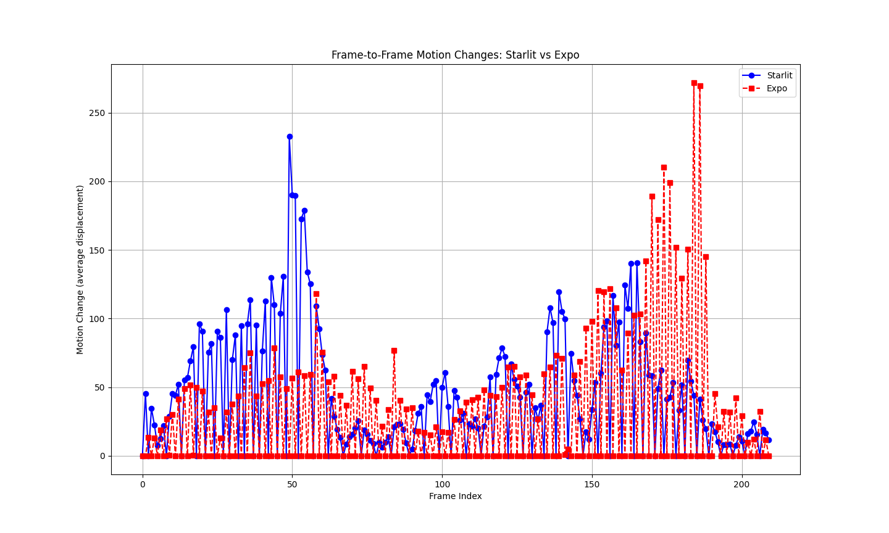

# physical-ribbon

Physical Ribbon
物理するリボン

## Description

<https://blog.kadoyukasi.org/posts/20241230> (in JP only)

For copyright reasons, the contents of the resource directory cannot be shared. 210 consecutive screenshots of the same scene are used as input data. However, it is not possible to confirm the exact identity of the data, since the video data was transferred from different 3D model data in different environments and from only one direction.

Furthermore, only the ribbon part is not detected for comparison, so it is not possible to draw any conclusions. The implication is that this is experimental level data that can be used if the detection target is brushed up from here.

## Result



## Run

```bash
# Place images to be compared in the resources directory.
# ./resources/expo and ./resources/starlit
rye init
rye run physical-ribbon
```

If rye is not installed, please download it from <https://rye.astral.sh/>.
